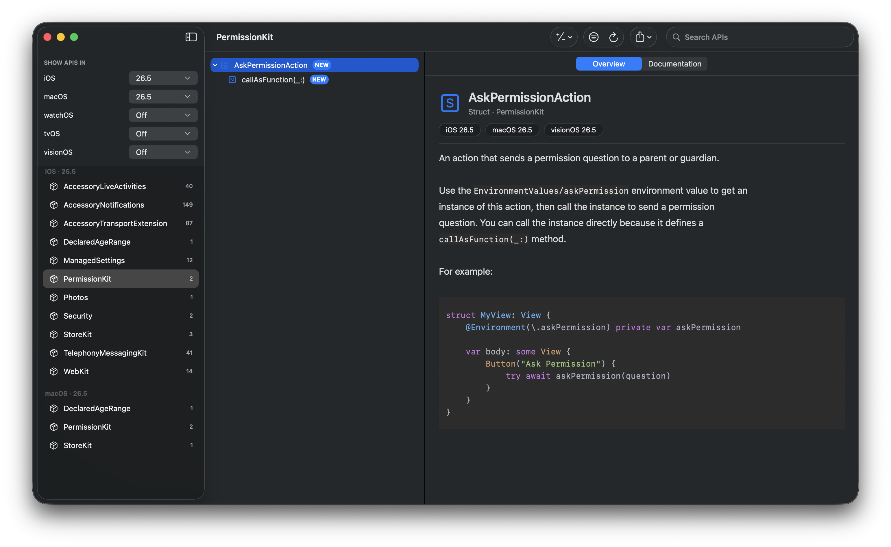

# Apple API Viewer

A macOS app and command line tool for finding out what's new in Apple's SDKs, release by release.



- [Why](#why)
- [Quick start](#quick-start)
- [The CLI](#the-cli)
- [Building from source](#building-from-source)
- [How it works](#how-it-works)
- [License](#license)

## Why

Every year Apple ships new OS releases, plus point updates through the year, and each one adds APIs that don't always get talked about publicly. Figuring out what's actually new is harder than it should be, because the developer docs only show availability one symbol at a time and there's no way to ask for everything new in, say, iOS 26.5 across the whole SDK. I built this tool to solve that problem for myself.

Instead of scraping the docs website, the app extracts symbol graphs from the SDKs inside your installed Xcodes and indexes them locally into SQLite. That means the answers come straight from the SDK, everything works offline, and the data is exactly as current as whatever Xcode you have installed, betas included.

## Quick start

You need macOS 26 and at least one installed Xcode.

> [!NOTE]
> The on-device "Summarize what's new" feature needs Apple Intelligence to be enabled.

The first launch indexes your active Xcode's SDKs, which takes a few minutes. Everything after that is instant, and each Xcode gets its own index, so switching between them doesn't rebuild anything.

In the app you can:

- Browse by platform and release, with more than one release per platform at once
- Walk a symbol tree per framework with kind filters, or search across the whole index
- Compare two Xcodes' indexes to see what an SDK release added, removed, and changed, down to a single symbol
- Export a framework's new APIs as Markdown, or get an on-device summary of what changed
- Search from the menu bar, and use the App Intents in Shortcuts, Siri, and Spotlight
- Keep an index per Xcode, including ones you've since deleted

## The CLI

`apple-api-viewer-cli` ships inside the app bundle. You can install it from the app's Settings ("Install command line tool"), which links it into `/usr/local/bin`, or do the same thing yourself:

```sh
sudo ln -sf "/Applications/Apple API Viewer.app/Contents/Helpers/apple_api_viewer_cli" /usr/local/bin/apple-api-viewer-cli
```

| Command      | What it does                                            |
|--------------|---------------------------------------------------------|
| `frameworks` | Lists frameworks with new API in the selected releases  |
| `new`        | Lists a framework's new APIs                            |
| `diff`       | Shows what two Xcodes' indexes add, remove, and change  |
| `search`     | Searches symbols across the index                       |
| `show`       | Shows one symbol with its availability                  |
| `platforms`  | Lists the indexed platforms and their releases          |
| `summarize`  | Runs the same on-device digest as the app               |
| `index`      | Builds, checks, re-indexes, or deletes the index        |
| `xcode`      | Manages which Xcodes get indexed                        |

Every command takes `--format json` for scripting and documents itself through `--help`.

## Building from source

```sh
brew install --cask tuist
tuist install
tuist generate
open AppleAPIViewer.xcworkspace
```

Then build and run the `apple-api-viewer` scheme.

To run the tests, use `swift test` in each package under `Modules/` and the `apple-api-viewer-cli-tests` scheme for the CLI. The eval harness in `Evals/` grades the on-device summaries and needs Apple Intelligence.

The DocC reference pages for the modules are published at [theblixguy.github.io/apple-api-viewer](https://theblixguy.github.io/apple-api-viewer/), and each release rebuilds them.

## How it works

The app runs `swift symbolgraph-extract` for every SDK and module in the Xcode you select (it finds your default one automatically), parses the output, and merges duplicate symbols by USR. Everything is stored in a SQLite database with full text search, and each symbol keeps the exact OS version that introduced it on each platform, so the newest SDK already contains the full history and there's no need to index older ones.

## License

MIT License

Copyright (c) 2026 Suyash Srijan

Permission is hereby granted, free of charge, to any person obtaining a copy
of this software and associated documentation files (the "Software"), to deal
in the Software without restriction, including without limitation the rights
to use, copy, modify, merge, publish, distribute, sublicense, and/or sell
copies of the Software, and to permit persons to whom the Software is
furnished to do so, subject to the following conditions:

The above copyright notice and this permission notice shall be included in all
copies or substantial portions of the Software.

THE SOFTWARE IS PROVIDED "AS IS", WITHOUT WARRANTY OF ANY KIND, EXPRESS OR
IMPLIED, INCLUDING BUT NOT LIMITED TO THE WARRANTIES OF MERCHANTABILITY,
FITNESS FOR A PARTICULAR PURPOSE AND NONINFRINGEMENT. IN NO EVENT SHALL THE
AUTHORS OR COPYRIGHT HOLDERS BE LIABLE FOR ANY CLAIM, DAMAGES OR OTHER
LIABILITY, WHETHER IN AN ACTION OF CONTRACT, TORT OR OTHERWISE, ARISING FROM,
OUT OF OR IN CONNECTION WITH THE SOFTWARE OR THE USE OR OTHER DEALINGS IN THE
SOFTWARE.
